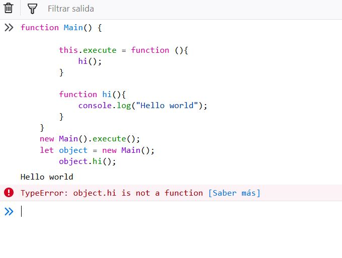

# Object-oriented programming

Object-oriented programming (oop) is a programming.
This is very important. Normally the object represent a entity, for example
a user, a car, a purchase. With object you can create modules.

Modularity is the ability to divide the problem into small independent parts, this goes beyond the encapsulation of a simple procedure of structured programming that we have seen so far. Here a set of operations and data that are closely related to each other forming a module is encapsulated.

An object-based language gives us the ability to define objects like javascript.


## Class and Object

The way easier for explain class and object.
The class is a cookies mold and the object is the cookie.

Therefore you can build a lot objects with one class.

### Syntax

```
    function Main {

    	this.execute = function (){
    		//this is one comment
    		//your code
    		console.log("Hello world");
    	}
    }
    //you can execute object without variables
     new Main().execute();

    //you can execute object in variables
    let object = new Main();
    object.execute();
```

 The Syntax is very similar that function but has important differents.

 - **new** The new operator lets developers create an instance of a user-defined object type or of one of the built-in object types that has a constructor function.
 Therefore each time you execute new you use the **class** for create a new **object**.

 - **this**. You can use this for share methods and properties in other place in your code.
  (this behaves a little differently in JavaScript compared to other languages).

## Control the access with "This"**.

 We carry on with "this". We can control the access, this important we only  should show the main methods out our class.


### Share you method

  ```javascript
    function Main() {

    	this.execute = function (){
    		hi();
    	}

    	function hi(){
    		console.log("Hello world");
    	}
    }
    new Main().execute();
    let object = new Main();
        object.execute();
  ```
  Fine, all correct. You have access.


### Don't share you method

```javascript
    function Main() {

    	this.execute = function (){
    		hi();
    	}

    	function hi(){
    		console.log("Hello world");
    	}
    }
    new Main().execute();
    let object = new Main();
        object.hi();
  ```

  Fine, all correct. You don't have access.
  When you try entry in function that doesn't share you can read.
  "TypeError: object.hi is not a function".
  This error is little confuse.
  How we can't access the object this error is show.

  


## Global Variables
empty

## POJO Plain old object javascript
empty 


